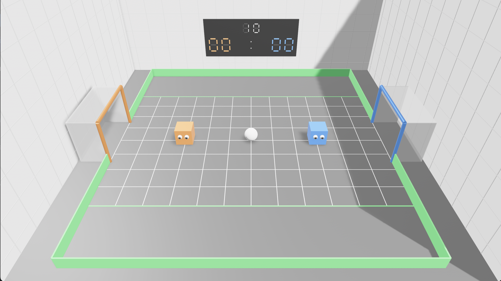

# Cube Soccer 3D



A 3D soccer game environment built with [Bevy](https://bevyengine.org/) and [Rapier3D](https://rapier.rs/) physics, designed as a reinforcement learning testbed.

Two cube-shaped players compete to score goals in an arena with realistic physics. Train AI agents using Python (Gymnasium-compatible) or play manually with keyboard controls.

## Features

- **Realistic Physics**: Powered by Rapier3D with proper collisions, friction, and bouncing
- **RL-Ready**: Gymnasium-compatible environment with customizable observations and rewards
- **Python Bindings**: PyO3 bindings for training with Stable-Baselines3, RLlib, etc.
- **Two-Player Support**: Human vs Human, Human vs AI, or AI vs AI modes
- **Visual Scoreboard**: 7-segment LED display on the arena wall
- **Configurable**: Easily tune physics, rewards, and game parameters

## Quick Start

### Play the Game

```bash
# Clone the repository
git clone https://github.com/Aijo24/Cube-soccer-3D.git
cd Cube-soccer-3D

# Run the game (human vs human)
cargo run --example human_vs_human
```

### Controls

| Team   | Movement      | Jump  |
|--------|---------------|-------|
| Orange | W/A/S/D       | Space |
| Blue   | Arrow Keys    | Enter |

## Installation

### Prerequisites

- Rust 1.75+ ([rustup.rs](https://rustup.rs/))
- Python 3.8+ (for RL training)

### Build from Source

```bash
# Build the Rust library
cargo build --release

# Run examples
cargo run --example human_vs_human    # Two players
cargo run --example human_vs_ai       # Play against AI
cargo run --example ai_vs_ai          # Watch AI play
cargo run --example benchmark         # Performance test
```

### Python Installation

```bash
# Install maturin
pip install maturin

# Build and install Python bindings
maturin develop --release

# Verify installation
python -c "from cube_soccer import CubeSoccerEnv; print('OK')"
```

## Reinforcement Learning

### Environment Interface

The environment follows the Gymnasium API:

```python
from cube_soccer import CubeSoccerEnv

env = CubeSoccerEnv()
obs, info = env.reset()

for _ in range(1000):
    action = env.action_space.sample()  # Your agent's action
    obs, reward, terminated, truncated, info = env.step(action)

    if terminated or truncated:
        obs, info = env.reset()
```

### Observation Space

Each player observes 22 normalized features (44 total):

| Feature | Description | Range |
|---------|-------------|-------|
| Player position | x, y, z coordinates | [-1, 1] |
| Player velocity | vx, vy, vz | [-1, 1] |
| Opponent position | Relative coordinates | [-1, 1] |
| Opponent velocity | Relative velocity | [-1, 1] |
| Ball position | Relative to player | [-1, 1] |
| Ball velocity | vx, vy, vz | [-1, 1] |
| Goal distances | Own and opponent goal | [0, 1] |
| Score difference | Normalized by 10 | [-1, 1] |
| Time remaining | Normalized | [0, 1] |

### Action Space

Continuous actions for each player (8 total):

| Action | Index | Range | Description |
|--------|-------|-------|-------------|
| move_x | 0, 4 | [-1, 1] | Left/Right |
| move_z | 1, 5 | [-1, 1] | Forward/Backward |
| jump | 2, 6 | [-1, 1] | Jump if > 0.5 |
| reserved | 3, 7 | [-1, 1] | Future use |

### Rewards

| Event | Reward |
|-------|--------|
| Score a goal | +10.0 |
| Concede a goal | -10.0 |
| Ball toward opponent goal | +0.01/step |
| Touch the ball | +0.1 |
| Win the match | +5.0 |
| Lose the match | -5.0 |

### Training with Stable-Baselines3

```python
from stable_baselines3 import PPO
from cube_soccer import CubeSoccerEnv

env = CubeSoccerEnv()
model = PPO("MlpPolicy", env, verbose=1)
model.learn(total_timesteps=1_000_000)
model.save("cube_soccer_agent")
```

See `python/train_ppo.py` for a complete training script with:
- Parallel environments
- Evaluation callbacks
- WandB integration
- Model checkpointing

## Project Structure

```
cube-soccer/
├── src/
│   ├── lib.rs              # Library entry point
│   ├── main.rs             # Standalone executable
│   ├── game/               # Core game logic
│   │   ├── config.rs       # Game constants
│   │   ├── events.rs       # Game events
│   │   ├── plugin.rs       # Bevy plugin
│   │   └── state.rs        # Game state
│   ├── entities/           # Game objects
│   │   ├── arena.rs        # Arena walls
│   │   ├── ball.rs         # Ball physics
│   │   ├── cube_player.rs  # Player cubes
│   │   ├── field.rs        # Playing field
│   │   └── goal.rs         # Goals and nets
│   ├── systems/            # Bevy ECS systems
│   │   ├── movement.rs     # Player movement
│   │   ├── physics.rs      # Physics config
│   │   ├── scoring.rs      # Goal detection
│   │   └── ...
│   ├── input/              # Input handling
│   │   ├── keyboard.rs     # Human controls
│   │   └── ai_controller.rs # AI input
│   ├── rl/                 # RL interface
│   │   ├── environment.rs  # Gym-like env
│   │   ├── observation.rs  # State extraction
│   │   ├── action.rs       # Action handling
│   │   └── reward.rs       # Reward calculation
│   └── python/             # Python bindings
│       └── bindings.rs     # PyO3 interface
├── examples/               # Example programs
├── python/                 # Python training scripts
└── assets/                 # Game assets
```

## Configuration

Key parameters in `src/game/config.rs`:

### Arena
```rust
ARENA_WIDTH: 30.0       // Total arena width
FIELD_WIDTH: 24.0       // Playing field width
FIELD_DEPTH: 16.0       // Playing field depth
GOAL_HEIGHT: 4.0        // Goal height
GOAL_DEPTH: 6.0         // Goal opening width
```

### Physics
```rust
GRAVITY: -50.0          // Gravity strength
CUBE_MAX_SPEED: 15.0    // Max player speed
CUBE_JUMP_FORCE: 60.0   // Jump impulse
BALL_RESTITUTION: 0.85  // Ball bounciness
```

### Match
```rust
MATCH_DURATION_SECS: 300.0  // 5 minute match
ROUND_DURATION_SECS: 15.0   // 15 second rounds
GOALS_TO_WIN: 10            // First to 10 wins
```

### RL Parameters
```rust
MAX_EPISODE_STEPS: 1000     // Steps per episode
OBSERVATION_SIZE: 22        // Features per player
ACTION_SIZE: 4              // Actions per player
```

## Examples

### Human vs Human
```bash
cargo run --example human_vs_human
```

### Train with PPO
```bash
cd python
python train_ppo.py --timesteps 1000000 --parallel 16
```

### Self-Play Training
```bash
cd python
python self_play.py --timesteps 5000000
```

### Evaluate Agent
```bash
cd python
python evaluate.py --model checkpoints/best_model.zip --episodes 100
```

## Contributing

Contributions are welcome! Please feel free to submit issues and pull requests.

1. Fork the repository
2. Create a feature branch (`git checkout -b feature/amazing-feature`)
3. Commit your changes (`git commit -m 'Add amazing feature'`)
4. Push to the branch (`git push origin feature/amazing-feature`)
5. Open a Pull Request

## License

This project is licensed under the MIT License - see the [LICENSE](LICENSE) file for details.

## Acknowledgments

- [Bevy](https://bevyengine.org/) - A refreshingly simple data-driven game engine
- [Rapier](https://rapier.rs/) - Fast and cross-platform physics engine
- [PyO3](https://pyo3.rs/) - Rust bindings for Python
- [Stable-Baselines3](https://stable-baselines3.readthedocs.io/) - Reliable RL implementations
