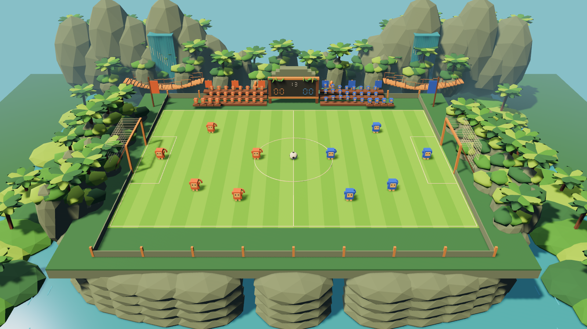

# Geometric jungle build verification

The original Rust/Bevy repository is imported with its MIT license. The visual changes are procedural and require no external model assets.

## Evidence

- `cargo build --bin cube-soccer` succeeds on Windows with the GNU Rust toolchain.
- `cargo check --all-targets` succeeds. The upstream example programs produce float-literal compatibility warnings on Rust 1.98.
- `cargo test --lib` covers the existing team/environment configuration tests and a jungle regression test. The latter checks retained player position, retained collider, no added decorative colliders, preserved scoreboard mesh, and attached monkey visuals.
- Capture mode launches the actual native renderer, writes `jungle-preview.png`, and exits successfully. The image has been inspected for pitch, player, ball, goal, scoreboard, and environment visibility.
- Movement, physics parameters and scoring retain their prior behavior. Level geometry is now 48 x 32, and resets restore distinct five-a-side formations. Five library tests pass, including all three reset paths and roster separation. Training must share the new geometry; the existing training wrapper still requires the teammate's multi-agent integration.

The screenshot below is a native broadcast render. `stadium-wave-b.png` captures a later animation phase; crowd poses and waterfall streak locations differ visibly.

## Limits

The expanded geometric presentation includes ten physical monkeys, spectator waves with raised arms, faceted foundation strata, bridges, translucent animated water ribbons, foam, lower riverbanks and foliage. The water is a visual effect, not a fluid solver. Team-agent integration remains separate work.

The local graphics driver logs missing optional validation/debug components and a no-work-submitted message around startup/shutdown. The scene renders and capture exits successfully. Performance across other GPUs has not been measured.
