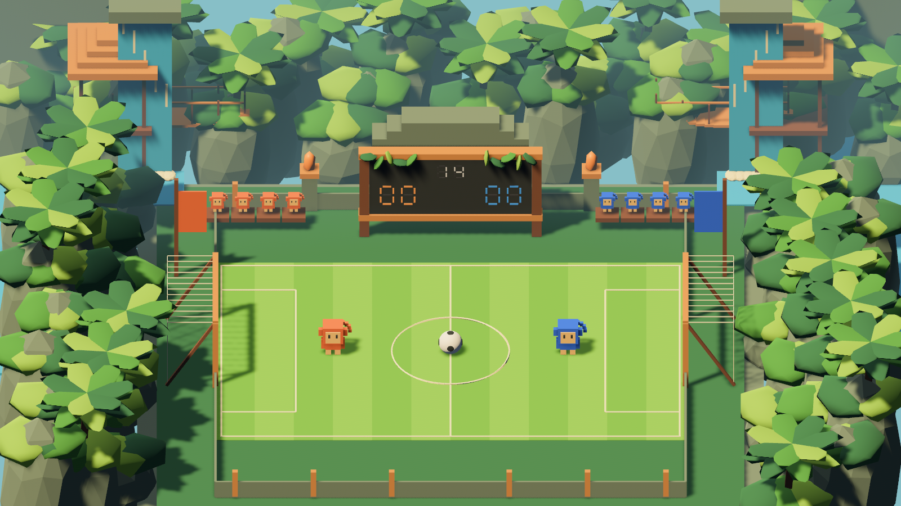

# Geometric jungle build verification

The original Rust/Bevy repository is imported with its MIT license. The visual changes are procedural and require no external model assets.

## Evidence

- `cargo build --bin cube-soccer` succeeds on Windows with the GNU Rust toolchain.
- `cargo check --all-targets` succeeds. The upstream example programs produce float-literal compatibility warnings on Rust 1.98.
- `cargo test --lib` covers the existing team/environment configuration tests and a jungle regression test. The latter checks retained player position, retained collider, no added decorative colliders, preserved scoreboard mesh, and attached monkey visuals.
- Capture mode launches the actual native renderer, writes `jungle-preview.png`, and exits successfully. The image has been inspected for pitch, player, ball, goal, scoreboard, and environment visibility.
- File hashes of movement, physics, scoring, resets, physics configuration, player/ball/goal definitions, and RL observations/environment match the imported upstream source.

The screenshot below is an engine render, separate from `geometric-concept.png`, which is the generated design reference.

## Limits

This is the requested initial geometric presentation: two simulated monkeys, decorative spectators, faceted vegetation and cliffs, wooden goals, a scoreboard shrine, bridges, huts, flowing waterfall streaks, and swaying foliage. The friend’s team-agent integration and the upstream placeholder RL implementation remain separate work.

The local graphics driver logs missing optional validation/debug components and a no-work-submitted message around startup/shutdown. The scene renders and capture exits successfully. Performance across other GPUs has not been measured.
